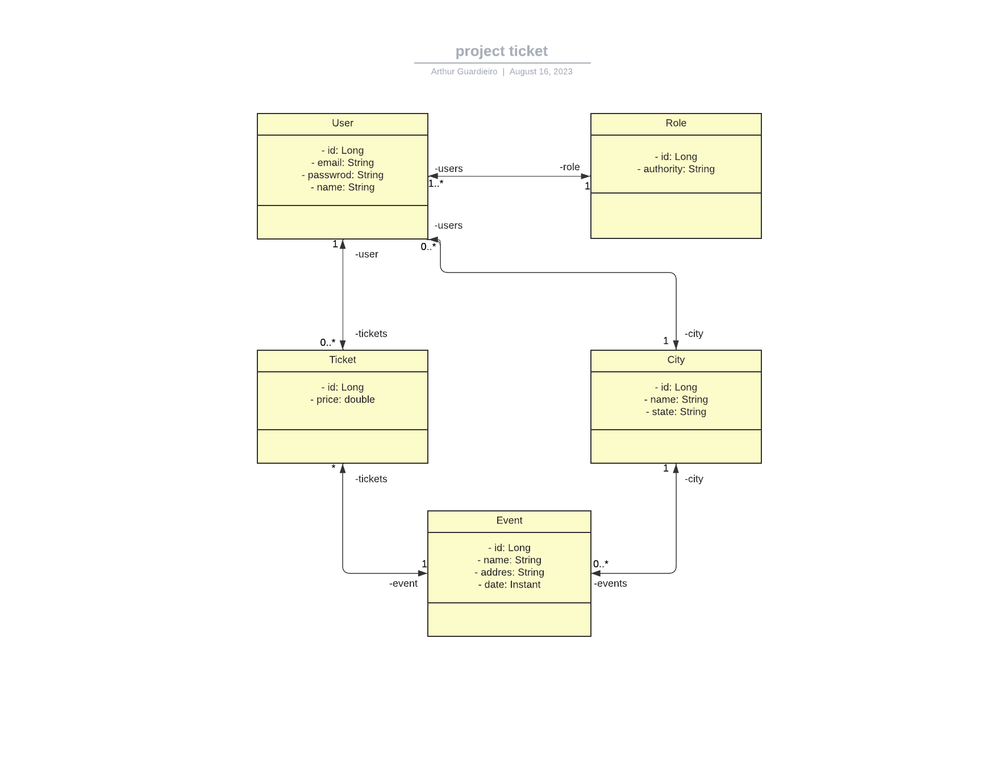

# Project Ticket


# Sobre o projeto

Project Ticket é uma aplicação backend de um sistema de venda de ingressos online. A aplicação visa executar operações de CRUD que considero relevantes para o funcionamento do sistema. Posteriormente, desejo transformá-lo em uma aplicação fullstack.

## Modelo conceitual

<p align="center">
    
</p>

## Tecnologias utilizadas 

- Java
- Spring Boot
- JPA / Hibernate
- Maven

## Como executar o projeto 

Pré-requisitos: Java 17

```bash
# clone o repositório
git clone https://github.com/ArthurGuardieiro/project-ticket.git

# entre na pasta backend do projeto
cd backend

# execute o projeto
./mvnw spring-boot:run 
```

## Coleção postman com todas as requisições

https://api.postman.com/collections/27633928-17680f53-6b89-4198-91c8-e6b82ee34ba6?access_key=PMAT-01H7XD03X38DZ6SJ9GTRVFVTN1